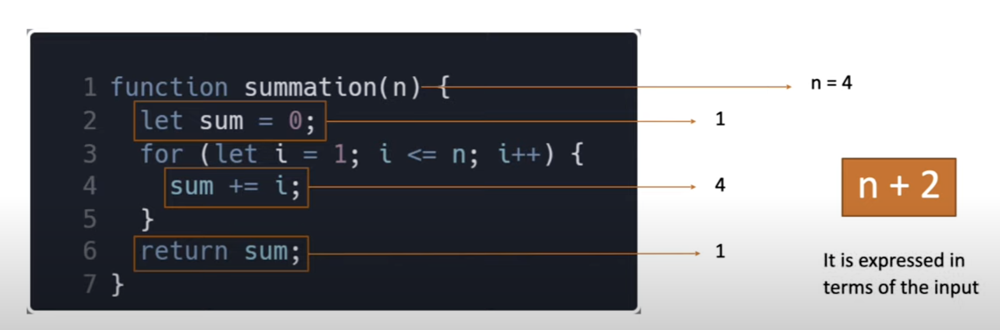
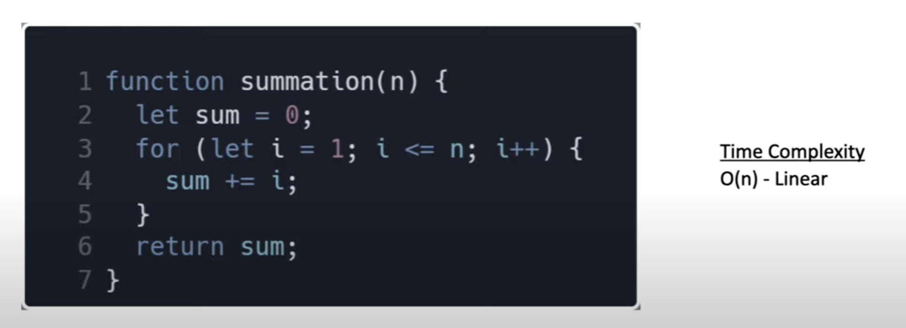
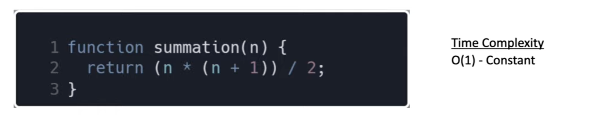
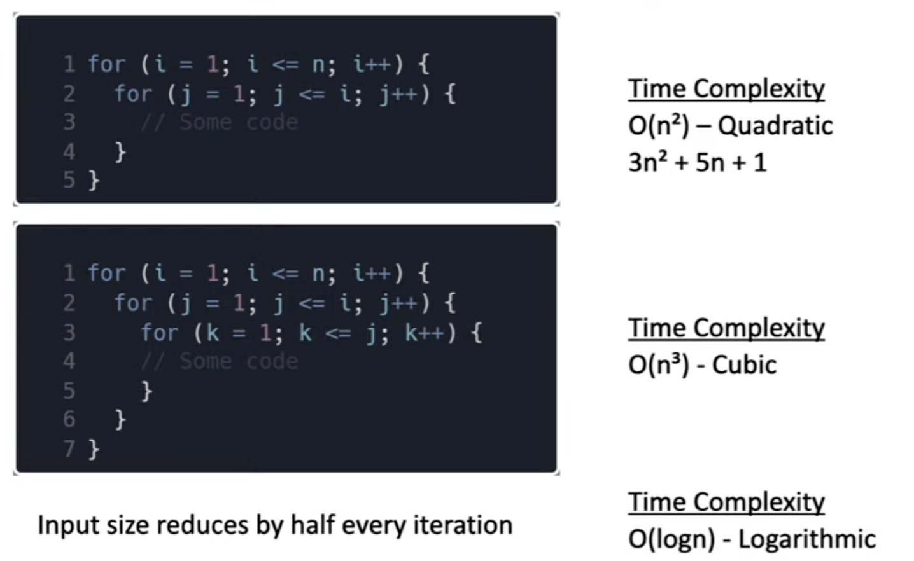
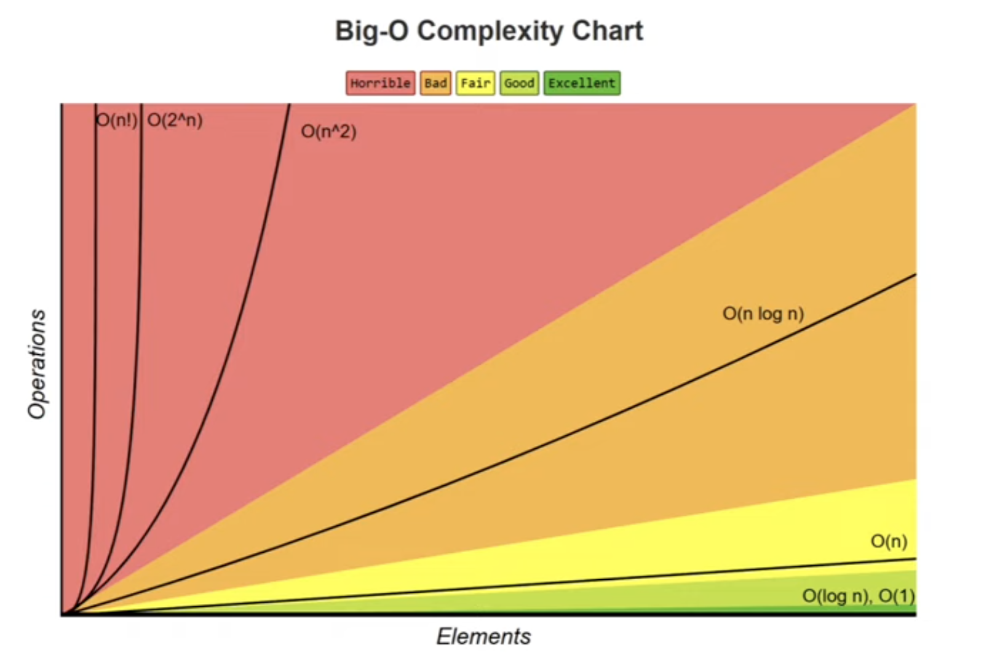

# DSA in javascript

- Algorithm
- Measuring Performance
- Time and space complexity
- Big O Notation
- Math alogorithms
- Sort
- Search
- Misc. Algorithms and problem solving

## pre-requisites
- Modern js
  - JS fundamentals crash course
  - complete JS Advanced crash course
- https://www.youtube.com/@Codevolution

## What is an algorithm
- An algo is a set of well defined instructions to solve a particular problem
- As a dev, you're going to come across problems
  - algos are different techniques to efficently solve those problems
  - one problem can be solved in many ways using different algos
  - every algo comes with its own tradeoffs when it comes to performance

## Time and space complexity
- there are multiple ways to solve one problem
- how do we analyse which one of them is most efficient algo
- generally, when we talk about performance, we use an absolute measure
- if i can run 100 meters in 12 secs, i'm faster than someone who takes 15 secs

### Alogs analysis
- the absolute running time of an algo cannot be predicted, since it depends on a number of factors
  - programming language used to run the program
  - the computer the program runs on
  - other factors running at the same time
  - quality of the operating systems
- we evaluate the performance of an algo in terms of its input size
  - Time Complexity
    - The amount of time taken by an algorithm to run, as a function of input size
  - Space Complexity
    - The amount of memory taken by an algorithm to run, as a function of input size
- By evaluating against the input size, the analytis is not only machine independent but the comparision is also more appropriate 
- There is no one solution that works every single time. It is always good to know multiple ways to solve the problem and use the best solution, given your constraints
- if you have very little memory to work with, you should pick a solution that is relatively slower but needs less space

### How to represent complexity
- Asymptotic notations
  - Mathematical tools to represent time and space complexity
    - Big-O Notation (O-notation) - worst case complexity
    - Omega Notation (gama-notation) - best case complexity
    - Theta Notation (theta-notation) - average case complexity
  - we are primarily concerned about worst case complexity (Big O)

### Big O
- The worst case complexity of an algo is represented using Big-O notation
- Big-O notation describes the complexity of an algo using algebraic terms
- It has two imporatant characteristics
  - It is expressed in terms of the input
  - It focuses on the bigger picture without getting caught up in the minute details

#### Time complexity
- it represents worst case time complexity
  - time takes to exeucte the program in worst case scenario
- In below number 2 is ignored because it focuses on bigger pictures and ignores small constants
- in most of the loops time complexity is linear

- In single operations time complexity is constant

- In nested loops time complexity is quadratic

#### Space complexity
- (1) - constant
  - If the algo do not need extra memory Or the memory needed does not depend on the input size. The space complexity is constant `O(1)`
    - sorting algos sort within the array without utilising additional arrays
- O(n) - linear 
- O(logn) - Logarithmic
- Although it is common to solve with quadratic time or space complexity, it is recommended to avoid quadratic

### few points to note in time and space complexity
- Multiple algos exist for the same problem and there is no right solution. different alogs work well under diff constraints
- The same algo work with same programing lang can be implemented in diff ways
- when writing program at work, don't lose the sight of the big picture, rather than writing clever code, write code that is simple to read and maintain

## Big-O of objects
- objects are collection of key value pairs
- below are the time complexity of objects operations
  - insert/remove = O(1)
  - Access = O(1)
  - Search = O(1)
  - Object keys = O(n)
  - Object values = O(n)
  - Object entries = O(n)

## Big-O of arrays
- Arrays are collection of ordered elements
- below are the time complexity of arrays operations
  - insert/remove at the end of an array = O(1)
  - insert/remove at the beggining of an array = O(n)
    - this is because insert or removal of an element from an array will lead to indices adustment of entire array 
  - Access element = O(1)
  - Search element = O(n)
  - Push/pop element = O(1) 
  - shift/unshift/concat/slice/splice = O(n)
  - forEach/map/filter/reduce = O(n)
    - Above methods may have callback functions with loops, which leads to quadratic time complexity
