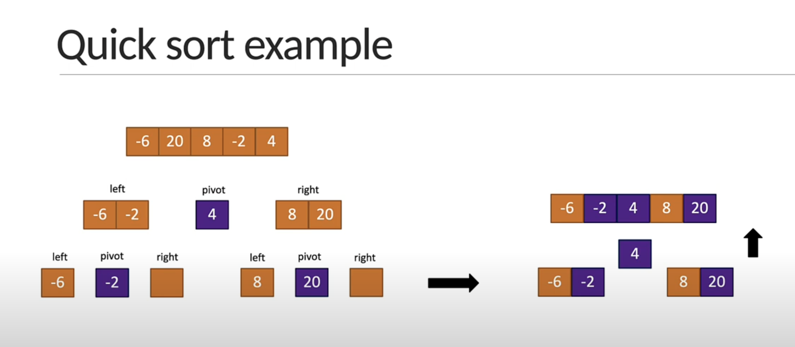

# Algorithms


## Match algorithms
- [fibonacci sequence](./problems/01.fibbonacci.js)
- [factorial of a number](./problems/02.factorial.js)
- [prime number](./problems/03.prime-numbers.js)
- [power of two](./problems/04.power-of-two.js)
- [recursion](./03.recursion.md)
- [fibonacci sequence with recursion](./problems/05.recursive-fibbonacci.js)
- [factorial of a number with recursion](./problems/06.recursive-factorial.js)


## Search Algos
  - [linear search](./problems/07.linear-search.js)
  - [Binary search](./problems/08.binary-search.js)
  - [Recursive binary search](./problems/09.recursive-binary-search.js)


### Linear Search
  - linear search is simple search, iterate over the entire array and find the element
  - Big-O is O(n)
### Binary search
  - binary search is only for sorted arrays
  - Big-O is O(logn)


## Sorting algorithms
  - bubble sort
  - insertion sort
  - quick sort
  - merge sort


#### Bubble sort
  - given an array of integers sort the array


#### Quick sort
- Identify the pivot element in the array
  - first element
  - last element
  - random element
  - median element
- put everything that's smaller than the pivot into a left array and everything thats greater than the pivot into a right array
- repeat the process for the individual left and right arrays till you have an array of length 1 which is sorted by definition
- repeatedly concatenate the left array, pivot and right array till one sorted array remains




#### Merge sort
- Devide the array into sub arrays, each containg only one element (An array with one element is considered sorted)
- Repeatedly merge the sub arrays to produce new sorted sub arrays untill there is only one sub array remaining. that will be the sorted array.


## Misc. Problems
- Cartesian product
- Climbing staircase
- Tower of hanoi


### Cartesian product
- Given two finite non-empty sets, find their cartesian product 
- Given two sets A and B, where:
	•	A = {a₁, a₂, a₃, ..., aₙ}
	•	B = {b₁, b₂, b₃, ..., bₘ}

- Write a program to compute the Cartesian Product of the two sets, defined as:

```
A \times B = \{(a, b) \mid a \in A, b \in B\}
```

Input:
	•	Two sets A and B represented as arrays or lists of size n and m.

Output:
	•	A list of ordered pairs representing the Cartesian product of A and B.


