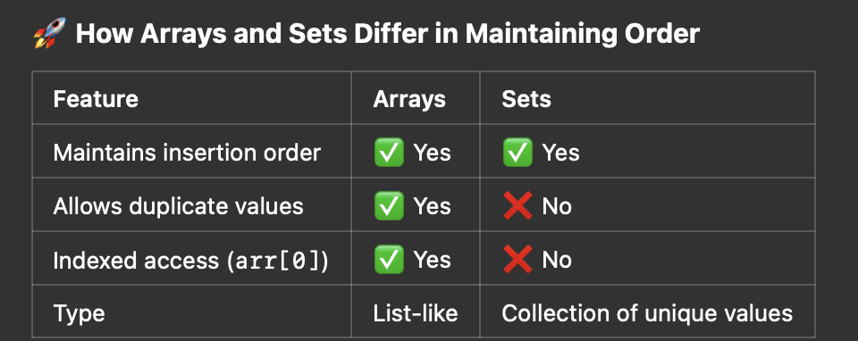
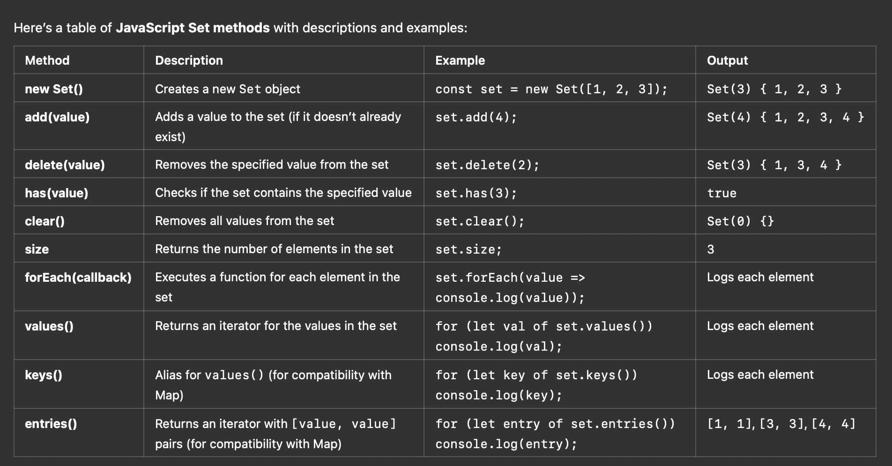
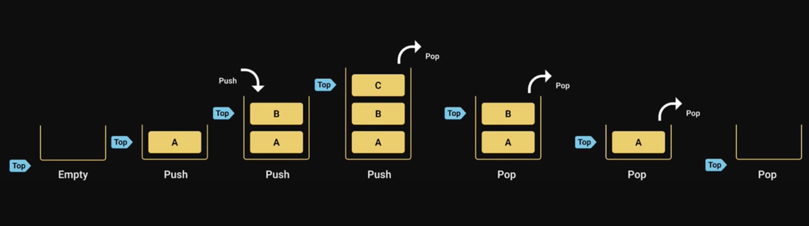

# Data Structures
- Different languages will have different data structures
- It is possible to implement data structures in a few differnt ways

## What is DS
- DS is a way to store and organize data so that it can be used efficiently
- DS is a collection of data values, the relationships among them, and the functions or operations that can be applied to that data

## Why learn data structures
- Almost every application we build involves data that is modelled in a certain way
- to efficiently manage that data, you need datastructures
- The difference b/w a function taking a few milliseconds vs a few seconds or even minutes comes down to the selection of the right data structure
- The data structures help you solve the problems in a more efficent way, both in terms of memory and time.
- Learning about DS also help you gain a more profound understanding of things you're already aware
  - DOM - Tree data structure
  - Browser back and forward - stack data structure
  - OS Job Scheduling - Queue Data Structure

## Types of DS in JS
  - built-in
    - Arrays
    - Objects
    - Sets
    - Maps
  - Custom DS
    - Stacks
    - Queues
    - Circular Queues
    - Linked Lists
    - Hash Tables
    - Trees
    - Graphs

### Arrays
- An array is a ds that can hold collection of values
- arrays can contain mix of different data types. you can store strings, booleans, numbers, or even objects all in the same array
- arrays are re-sizable. you don't need to declare size of an array before creating it.
- js arrays are zero-indexed and the insertion order is maintained
- Arrays are iterables, they can be used with for of loop
- [Array Problems](./problems/ds-array.js)


### Objects


TODO


### Sets
- A set data structure can hold collection values, however the values must be unique
- Set can contain a mix of different data types. you can store strings, booleans, numbers or even objects all in the same set
- Sets are dynamically sized. you don't have to declare the size of a set before creating it
- Sets do not maintain an insertion order
- Sets are iterables. they can be used with for of loop

#### Sets vs Arrays
- Arrays can contain duplicate values, whereas sets cannot
- inseration order is maintained in arrays but it is not the case with sets
- searching and deleting an element in the set is faster compared to arrays
- sets can only be created with constructor `new Set()`




### set methods


#### Practice
- [Sets Problems](./problems/ds-sets.js)


## Maps
- A map is an ordered collection of key value pairs. both the keys and values can be of any type
- to retrieve a value, you can use the corresponding key
- maps are iterables they can be used with for of loop

### maps vs objects
- maps are unordered where as objects are ordered
- keys in objects can only be string or symbol whereas maps can of any type of key
- object has prototype and may contain default inherited keys which may collde with your own keys if not careful, map do not have prototype inheritance
- objects are not iterables whereas maps are iterables
- the number of items in the object must be determined manually where as it is readily available with the size property in map
- appart from storing the data you add functionality to object where as maps just only store data


### Maps Practice
- [maps problems](./problems/ds-maps.js)


## Stack
- The stack is the data structure is a sequential collection of elements that follows the principle of Last In First Out (LIFO)
- The last element inserted into the stack is the first element to be removed
- A stack of plates. The last plate placed on top of the stack is also the first plate to be removed from the stack 
- Stack is an abstract data type. It is defined by it's behaviour rather than being a mathematical model.
- The stack ds supports two main operations
  - push, which adds an element to the collection
  - pop, which removes the most recently added element from the collection 




### usage
- stack is imple array in the js
- browser history tracking
- Go forward and backword button in the browser 
- undo operation whey typing 
- expresion conversions
- call stack in js runtime


```
class Node {
  constructor(value) {
    this.value = value;
    this.next = null;
  }
}

class Stack {
  constructor() {
    this.top = null;
    this.length = 0;
  }

  // Push element onto the stack
  push(value) {
    const newNode = new Node(value);
    if (this.top) {
      newNode.next = this.top;
    }
    this.top = newNode;
    this.length++;
  }

  // Pop element from the stack
  pop() {
    if (!this.top) return "Underflow";
    const value = this.top.value;
    this.top = this.top.next;
    this.length--;
    return value;
  }

  // Peek at the top element
  peek() {
    if (!this.top) return "No elements in Stack";
    return this.top.value;
  }

  // Check if stack is empty
  isEmpty() {
    return this.length === 0;
  }

  // Get size of the stack
  size() {
    return this.length;
  }

  // Display elements of the stack
  print() {
    let current = this.top;
    let result = [];
    while (current) {
      result.push(current.value);
      current = current.next;
    }
    console.log(result.join(" "));
  }
}

// Usage
const stack = new Stack();

stack.push(10);
stack.push(20);
stack.push(30);

console.log(stack.peek()); // 30
console.log(stack.pop());  // 30
console.log(stack.size()); // 2
stack.print();             // 20 10
```


## queue
- The queue DS is a sequential collection of elements that follows the principle of First-In-First-Out (FIFO)
- 

